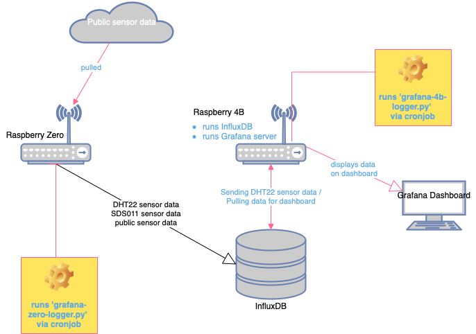
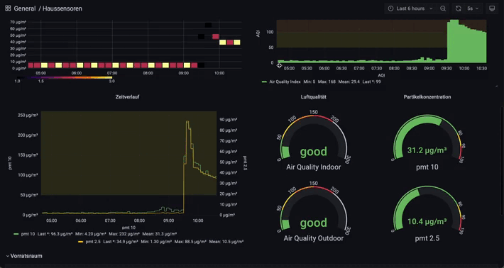
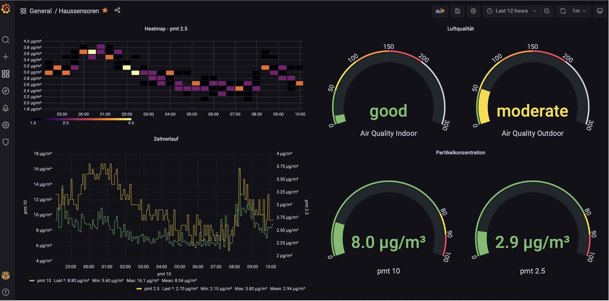

# Smarthome Dashboard with Grafana & InfluxDB

This is a complete overhaul of my [Raspberry Dashboard done with Flask](https://github.com/marwonn/Raspberry-DHT-22-Dashboard) project.

I switched from sqlite to InfluxDB which is much better prepared to deal with time series data. And I also switched to Grafana for creating the dashboard itself. Building nice looking graphs and interact with them is way more easy with Grafana (as I did before - by hand).

## Project structure



## Getting Started

### Dependencies

* [Grafana](https://grafana.com)
* [InfluxDB](https://www.influxdata.com/products/influxdb/)
* Raspberry (minimum Zero W or anything below for just sending/receving data)
* DHT-22 sensor
* SDS011 sensor
* optional: LED traffic light
* optional: Display


### Installing

* Copy & clone the source code.
* Set up a virtual environment: ```python3 -m venv venv```
* Pip install requirements: ```pip3 install -r requirements.txt```
* Install and bring up InfluxDB and Grafana on Raspberry


### Executing program
Grafana server is listening on ```http://<ip address>:3000```

## Dashboard example




## License

This project is licensed under the MIT License - see the LICENSE.md file for details.


## Acknowledgments

* [ikalchev](https://github.com/ikalchev/py-sds011/blob/master/sds011/__init__.py) for his SDS011 class. This makes talking to the sds011 sensor much easier.
* [draw.io](https://app.diagrams.net/)
